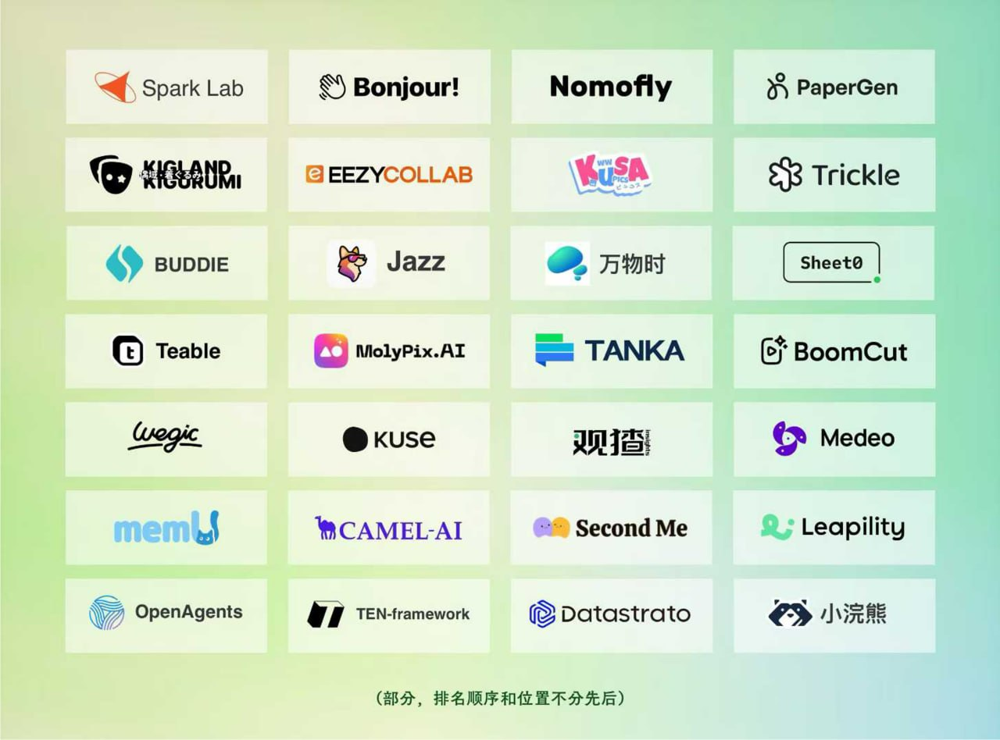

<div align="center">


# Go-to-Market Strategy Playbook

### Complete GTM strategy for AI products & startups — Product Hunt, KOL outreach, viral marketing, Reddit growth

[](https://github.com/Gingiris/gingiris-launch/stargazers)
[](https://github.com/Gingiris/gingiris-launch/network/members)
[](https://github.com/Gingiris/gingiris-launch/watchers)
[](https://opensource.org/licenses/MIT)
[](https://www.gingiris.com)
[](https://github.com/Gingiris/gingiris-launch/pulls)
[](https://github.com/Gingiris/gingiris-launch/commits/main)
[](https://github.com/Gingiris/gingiris-launch/graphs/contributors)

**[English](#english) | [中文](#中文版) | [日本語](references/ja/README.md) | [한국어](references/ko/README.md)**

</div>

---

## Table of Contents

- [Why This Playbook](#why-this-playbook)
- [GTM Strategy Results](#gtm-strategy-results)
- [Success Stories](#-projects-using-this-gtm-strategy)
- [English Guide](#english)
  - [Core Principles](#core-principles)
  - [GTM Timeline](#overall-timeline)
  - [Detailed Guides](#detailed-guides-english)
- [中文版](#中文版)
- [Quick Navigation](#quick-navigation-all-languages)
- [Use with AI Agents](#-use-with-ai-agents)
- [Get the Complete Playbook](#-get-the-complete-playbook)
- [About the Author](#about-the-author)
- [Related Playbooks](#related-playbooks)

---

> 💡 **Why Star this?** 
> *   **Battle-Tested GTM**: Documents the exact go-to-market strategies used for **30x PH #1** and **60k Stars**.
> *   **AI-Native**: Battle-tested AI Agent Skills to automate your go-to-market execution.
> *   **Product Hunt Strategy**: Access the playbook that earned 30x Product Hunt #1.

---

> 🌱 **Our Philosophy**
> 
> *"创业没有那么高大上，创业就是做生意。"* — Startups aren't glamorous; they're just business.
> 
> *"不要让你的 ego 大过你的用户。"* — Don't let your ego overshadow your users.
> 
> *"从 Day 0 就要勇敢收费。"* — Be brave enough to charge from Day 0.
> 
> This playbook isn't just tactics — it's a mindset shift. We believe in **real value over vanity metrics**, **community over broadcast**, and **learning from failures**.

---

> 💡 **Need a 1-on-1 GTM strategy call for your B2B/Open-source launch? Book a session for $200** (Crypto/USDT and Wire Transfer accepted) — [Contact @Iris_carrot on Telegram](https://t.me/Iris_carrot)

---

## Why This Playbook?

Created by **Iris (生姜iris)**, former cofounder & COO of [AFFiNE](https://github.com/toeverything/AFFiNE) (60k+ stars). This go-to-market strategy playbook documents the exact GTM tactics used at AFFiNE.

### GTM Strategy Results

| Metric | Result | Context |
|--------|--------|---------|
| 🏆 Product Hunt #1 Daily | 30 times | Go-to-market strategy at AFFiNE |
| ⭐ GitHub Stars (7 days) | 6,000+ | GTM launch results at AFFiNE |
| ⭐ GitHub Stars (18 months) | 33,000+ | Long-term GTM execution at AFFiNE |
| 🌍 Countries Reached | 100+ | Global go-to-market strategy |

---

## 🚀 Projects Using This GTM Strategy

Real go-to-market results from startups and founders using this playbook:

<div align="center">

</div>

**Featured Projects**: Spark Lab • Bonjour! • Nomofly • PaperGen • Kigland • EezyCollab • KusaPics • Trickle • Buddie • Jazz • 万物时 • Sheet0 • Teabie • MolyPix.AI • TANKA • BoomCut • Wegic • Kuse • 观擦 • Medeo • memU • CAMEL-AI • Second Me • Leapility • OpenAgents • TEN-framework • Datastrato • 小浣熊 *and more...*

> 📢 **Used this playbook for your launch?** We'd love to feature your story! [Submit your case study](https://github.com/Gingiris/gingiris-launch/issues/new?labels=success-story&title=🎉+Success+Story:+[Your+Project])

---

## ⭐ Star This Repo


If you find this go-to-market playbook useful, a GitHub Star ⭐ helps others discover it!

---

## 🦞 Use with AI Agents

This GTM strategy playbook is available as a **ClawdHub Skill** — install it directly into Claude Code, OpenClaw, or any compatible AI agent:

```bash
clawhub install gingiris-launch
```

> Your AI agent can then help you execute go-to-market strategies, generate content, and manage your campaign.

---

## English

> Author: Iris (生姜iris) | Version: Final v7.0 (Feb 2026)

### Core Principles

| Principle | Description |
|:----------|:------------|
| **User First, Start with Value** | All GTM content and channel strategies focus on creating real value for target users |
| **Content is King, Channels are Amplifiers** | High-quality content is the foundation; channels just amplify reach |
| **Think Global, Execute Local** | Maintain consistent global branding while localizing for different markets |
| **Quality Over Quantity** | Concentrate budget on high-value touchpoints, not spray-and-pray |

### Overall Timeline

| Phase | Timing | Key Milestones |
|:---|:---|:---|
| Strategic Prep | L-6 weeks | Define goals, ICP, value prop, keywords, budget |
| Asset Creation | L-5 to L-4 weeks | Website optimization, brand video, feature videos |
| Partnership Lock | L-4 to L-3 weeks | KOL screening, UGC recruitment, media outreach |
| Content Prep | L-3 to L-2 weeks | KOL content packages, UGC scripts, Reddit strategy |
| Final Confirmation | L-2 to L-1 weeks | Draft approval, launch timing locked |
| 🚀 **Product Launch** | Launch Day | Launch Week Day 1-5 |
| Momentum Building | L+1 to +4 weeks | Continuous operations, build momentum |
| 🎯 **PH Launch** | PH Day | 24-hour battle plan |

### Detailed Guides (English)

| Topic | Description | File |
|:---|:---|:---|
| Core Strategy & Cases | GTM strategy framework with real case studies | [references/en/strategy.md](https://github.com/Gingiris/gingiris-launch/blob/main/references/en/strategy.md) |
| Preparation SOP | Step-by-step go-to-market preparation | [references/en/preparation.md](https://github.com/Gingiris/gingiris-launch/blob/main/references/en/preparation.md) |
| Product Launch | Launch execution playbook | [references/en/product-launch.md](https://github.com/Gingiris/gingiris-launch/blob/main/references/en/product-launch.md) |
| Product Hunt Launch | PH #1 strategy and tactics | [references/en/ph-launch.md](https://github.com/Gingiris/gingiris-launch/blob/main/references/en/ph-launch.md) |
| Channel Templates | Ready-to-use GTM templates | [references/en/templates.md](https://github.com/Gingiris/gingiris-launch/blob/main/references/en/templates.md) |
| Toolkit | Tools for go-to-market execution | [references/en/tools.md](https://github.com/Gingiris/gingiris-launch/blob/main/references/en/tools.md) |

---

## 中文版

> 作者：Iris (生姜iris) | 版本：Final v7.0 (2026年2月)

### 核心原则

| 原则 | 说明 |
|:-----|:-----|
| **用户至上，始于价值** | 所有内容和渠道策略都以为目标用户创造真实价值为出发点 |
| **内容为王，渠道为后** | 高质量的内容是传播的根本，渠道只是放大器 |
| **全球化思维，本土化执行** | 保持全球一致品牌形象，针对不同市场本土化调整 |
| **只要活人，不要僵尸** | 预算集中投入极少数有价值的关键节点，而非撒胡椒面 |

### 详细指南（中文）

| 主题 | 说明 | 文件 |
|:---|:---|:---|
| 核心策略与案例 | GTM 策略框架与真实案例 | [references/strategy.md](https://github.com/Gingiris/gingiris-launch/blob/main/references/strategy.md) |
| 准备阶段 SOP | 分步骤的出海准备清单 | [references/preparation.md](https://github.com/Gingiris/gingiris-launch/blob/main/references/preparation.md) |
| Product Launch | 产品发布执行手册 | [references/product-launch.md](https://github.com/Gingiris/gingiris-launch/blob/main/references/product-launch.md) |
| Product Hunt 发布 | PH 打榜策略与技巧 | [references/ph-launch.md](https://github.com/Gingiris/gingiris-launch/blob/main/references/ph-launch.md) |
| 渠道内容模板 | 即用型 GTM 模板 | [references/templates.md](https://github.com/Gingiris/gingiris-launch/blob/main/references/templates.md) |
| 工具箱 | 出海执行工具集 | [references/tools.md](https://github.com/Gingiris/gingiris-launch/blob/main/references/tools.md) |
| 预算分配 | 预算规划与分配策略 | [references/budget.md](https://github.com/Gingiris/gingiris-launch/blob/main/references/budget.md) |

---

## Quick Navigation (All Languages)

| 🇺🇸 English | 🇨🇳 中文 | 🇯🇵 日本語 | 🇰🇷 한국어 |
|:---|:---|:---|:---|
| [Core Strategy](https://github.com/Gingiris/gingiris-launch/blob/main/references/en/strategy.md) | [核心策略](https://github.com/Gingiris/gingiris-launch/blob/main/references/strategy.md) | [コア戦略](https://github.com/Gingiris/gingiris-launch/blob/main/references/ja/strategy.md) | [핵심 전략](https://github.com/Gingiris/gingiris-launch/blob/main/references/ko/strategy.md) |
| [Preparation](https://github.com/Gingiris/gingiris-launch/blob/main/references/en/preparation.md) | [准备阶段](https://github.com/Gingiris/gingiris-launch/blob/main/references/preparation.md) | [準備段階](https://github.com/Gingiris/gingiris-launch/blob/main/references/ja/preparation.md) | [준비 단계](https://github.com/Gingiris/gingiris-launch/blob/main/references/ko/preparation.md) |
| [Product Launch](https://github.com/Gingiris/gingiris-launch/blob/main/references/en/product-launch.md) | [产品发布](https://github.com/Gingiris/gingiris-launch/blob/main/references/product-launch.md) | [製品ローンチ](https://github.com/Gingiris/gingiris-launch/blob/main/references/ja/product-launch.md) | [제품 출시](https://github.com/Gingiris/gingiris-launch/blob/main/references/ko/product-launch.md) |
| [PH Launch](https://github.com/Gingiris/gingiris-launch/blob/main/references/en/ph-launch.md) | [PH发布](https://github.com/Gingiris/gingiris-launch/blob/main/references/ph-launch.md) | [PHローンチ](https://github.com/Gingiris/gingiris-launch/blob/main/references/ja/ph-launch.md) | [PH 출시](https://github.com/Gingiris/gingiris-launch/blob/main/references/ko/ph-launch.md) |
| [Templates](https://github.com/Gingiris/gingiris-launch/blob/main/references/en/templates.md) | [内容模板](https://github.com/Gingiris/gingiris-launch/blob/main/references/templates.md) | [テンプレート](https://github.com/Gingiris/gingiris-launch/blob/main/references/ja/templates.md) | [템플릿](https://github.com/Gingiris/gingiris-launch/blob/main/references/ko/templates.md) |
| [Tools](https://github.com/Gingiris/gingiris-launch/blob/main/references/en/tools.md) | [工具箱](https://github.com/Gingiris/gingiris-launch/blob/main/references/tools.md) | [ツール](https://github.com/Gingiris/gingiris-launch/blob/main/references/ja/tools.md) | [도구](https://github.com/Gingiris/gingiris-launch/blob/main/references/ko/tools.md) |

---

## 📚 Get the Complete Playbook

Want all four playbooks in one comprehensive package? Get the **Open-Source Project Integrated Marketing Action Manual** — a complete guide covering go-to-market strategy, open source marketing, B2B growth, and ASO.

[](https://gingiris.gumroad.com/l/vhmkew)

---

## About the Author

**Iris (生姜iris)** — Former cofounder & COO of AFFiNE, led global go-to-market strategy from 0 to millions of users.

| Platform | Link |
|:---------|:-----|
| 🐦 Twitter | [@Gingiris_](https://twitter.com/Gingiris_) |
| 💼 LinkedIn | [Yipei Wei](https://www.linkedin.com/in/yipei-wei-550825105/) |
| 💬 Telegram | [@Iris_carrot](https://t.me/Iris_carrot) |
| 📧 Email | iris103195@gmail.com |

---

## Related Playbooks

| Playbook | Focus | Link |
|:---------|:------|:-----|
| gingiris-opensource | Open Source Launch Marketing | [GitHub](https://github.com/Gingiris/gingiris-opensource) |
| gingiris-b2b-growth | B2B SaaS Growth Playbook | [GitHub](https://github.com/Gingiris/gingiris-b2b-growth) |
| gingiris-aso-growth | Mobile App ASO & Growth | [GitHub](https://github.com/Gingiris/gingiris-aso-growth) |
| gingiris-user-interview | User Interview Playbook | [GitHub](https://github.com/Gingiris/gingiris-user-interview) |

---

## License

MIT License - Feel free to use and adapt for your own go-to-market strategy!
